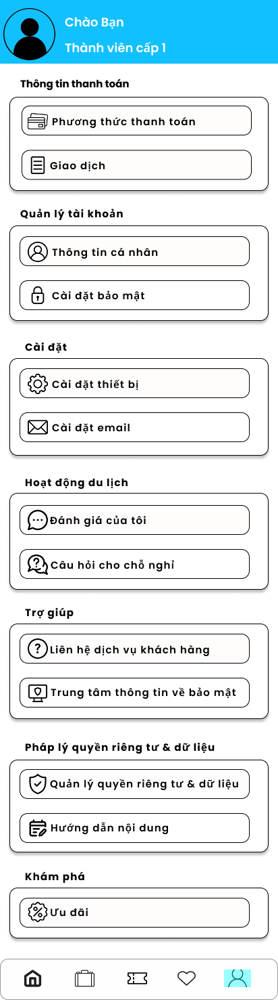

Travel App - Ứng Dụng Đặt Vé Máy Bay & Khách Sạn
Đồ án cuối kỳ - Ngành Công nghệ thông tin Trường Đại học Giao thông vận tải TP. Hồ Chí Minh (UTH)

Thành viên thực hiện (Nhóm 1)
Nguyễn Duy Tân - 091205014155

Đinh Nguyễn Công Bắc - 036205001695

Lê Tiến Công - 094205003183

Đặng Nguyễn Minh Phi - 070205003620

Giảng viên hướng dẫn: ThS. Trương Quang Tuấn

📝 Giới thiệu
Travel App là ứng dụng di động hiện đại giúp người dùng tối ưu hóa trải nghiệm du lịch. Ứng dụng tích hợp hai tính năng chính là đặt vé máy bay và đặt phòng khách sạn, đi kèm với hệ thống quản lý hành trình thông minh.

✨ Tính năng chính
Đăng nhập/Đăng ký: Xác thực người dùng qua Email và Firebase Auth.

Tìm kiếm thông minh: Lọc khách sạn và chuyến bay theo địa điểm, ngày tháng và nhu cầu cá nhân.

Đặt chỗ & Thanh toán: Quy trình thanh toán giả lập hỗ trợ nhiều phương thức (MoMo, Visa, Thanh toán tại chỗ).

Quản lý chuyến đi: Lưu trữ và hiển thị danh sách vé đã đặt (Active, Past, Cancelled) thời gian thực.

Giao diện hiện đại: Thiết kế chuẩn Material Design 3, hỗ trợ trải nghiệm UI/UX mượt mà.

🏗️ Kiến trúc dự án
Dự án được xây dựng dựa trên kiến trúc MVVM (Model-View-ViewModel) và Clean Architecture để đảm bảo tính mở rộng và dễ bảo trì.

View: Jetpack Compose (Declarative UI).

ViewModel: Quản lý State và xử lý logic nghiệp vụ.

Model: Data classes và Repository kết nối với Firestore/Local Data.

Navigation: Jetpack Navigation Compose giúp quản lý luồng màn hình.

🛠 Công nghệ sử dụng
Ngôn ngữ: Kotlin

UI Framework: Jetpack Compose

Network: Retrofit / Coil (Load ảnh)

Database/Backend: Firebase Firestore & Authentication

Local Storage: Room Database / DataStore (Lưu cache)

📱 Ảnh màn hình dự án

### 🏠 Màn hình Home

### ✈️ Màn hình Booking

### 👤 Màn hình Profile

